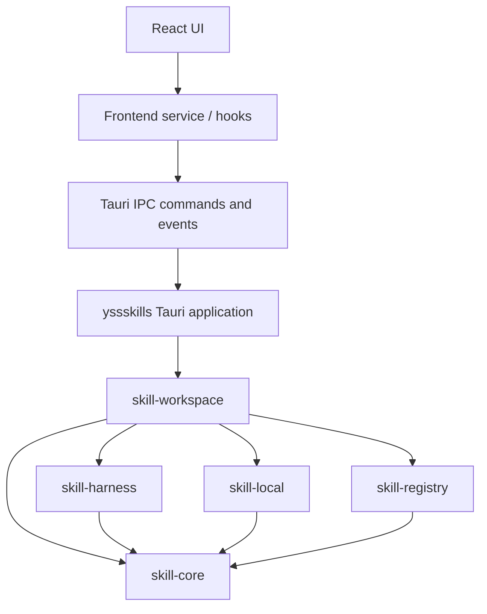

# YssSkills 架构

> 本文是仓库当前实现地图与目标架构的维护型文档。
> `.rules` 定义仓库级工程规则；本文定义模块职责、依赖方向、数据流和
> 重要不变量。两者不一致时，先验证实际行为，再同步更新本文。

## 1. 文档范围与当前状态

YssSkills 是一个通过 Tauri 提供桌面界面的 Skill 管理器。它需要同时处理：

- Skill 的稳定领域模型与 `SKILL.md` 解析；
- 不同 Agent Harness 的位置、能力和配置约定；
- 本机文件系统上的 Skill 扫描、安装和变化；
- 远程 Skill registry 的查询和来源解析；
- Skill 在全局、项目和链接工作区中的部署与同步。

当前仓库仍处于基础骨架阶段，但第一条业务纵切片已经落地：

- `src-tauri/Cargo.toml` 已声明 Cargo workspace，当前只包含根 Tauri package 和
  `crates/skill-core`；
- `skill-core` 已提供纯领域类型、`SKILL.md` frontmatter 解析、marker 规则、
  名称安全规范化和 focused tests；
- `src-tauri/crates/` 下其他目录仍是预留位置，尚未作为 Cargo member；
- 当前 Tauri 入口仍是模板命令，尚未接入 Skill 业务 IPC；
- 前端已接入 shadcn dashboard 外壳和 hash 路由，提供 Dashboard、Skills、Workspaces、Registry、Settings 五个静态演示页面；
- 本文后续章节描述尚未实现的目标结构，具体实现状态以代码和本段为准。

后续仍应按稳定契约逐步接入本地、Harness、registry 和工作区编排。不要为了匹配
目录图而一次性生成没有真实责任的空抽象。

## 2. 术语区分

本文中有三个容易混淆的词：

| 术语 | 含义 |
| --- | --- |
| **Cargo workspace** | Rust 工程级概念。把 Tauri 外壳和多个业务 crate 放在同一个依赖、锁文件和构建工作区中。 |
| **`skill-workspace`** | 负责 Skill 部署目标、同步关系和冲突编排的业务 crate。 |
| **Global / Project / Linked Workspace** | 产品领域概念。表示 Skill 被部署或链接到哪里。 |

Cargo workspace 不拥有产品上的 Workspace 状态；`skill-workspace` 也不等同于
Cargo workspace。

## 3. 总体架构

目标架构采用一个 Tauri 外壳、一个工作区编排 crate、一个纯领域 crate 和三个
职责明确的适配 crate：



依赖方向从外向内、从编排到能力实现：

- Tauri 和 React 只位于接口层；
- `skill-workspace` 负责用例编排和部署状态；
- `skill-core` 不依赖框架或基础设施；
- `skill-harness`、`skill-local`、`skill-registry` 各自隔离一种外部变化；
- 任何 crate 都不能通过共享内部模块绕过上述依赖方向；
- 不允许循环依赖。

### 3.1 Cargo crate 命名

目标 crate 名称如下。包名使用连字符，Rust 代码中的库名会自然转换为下划线：

| Cargo package | Rust library | 责任 |
| --- | --- | --- |
| `yssskills` | `yssskills_lib` | Tauri 启动、命令、事件和 IPC DTO；保留现有外壳名称。 |
| `skill-core` | `skill_core` | Skill 领域模型、解析结果和纯领域规则。 |
| `skill-harness` | `skill_harness` | Harness 描述、检测、路径和能力适配。 |
| `skill-local` | `skill_local` | 本机文件系统上的扫描、安装、监听和变化检测。 |
| `skill-registry` | `skill_registry` | 远程 registry 的搜索、详情、版本和来源解析。 |
| `skill-workspace` | `skill_workspace` | Global/Project/Linked Workspace 及部署同步编排。 |

`skill-harness` 比单独使用 `harness` 更能表达它管理的是 Agent Skill Harness；
`skill-workspace` 则避免与 Cargo workspace 概念混淆。现有的空占位目录在真正
实现时按此命名迁移；本次文档变更不要求提前生成 crate。

目标 Cargo workspace 形态为：

```toml
[workspace]
resolver = "2"
members = [
    ".",
    "crates/skill-core",
    "crates/skill-harness",
    "crates/skill-local",
    "crates/skill-registry",
    "crates/skill-workspace",
]
```

根 package `yssskills` 仍然是 Tauri 应用，负责把 IPC 请求交给
`skill-workspace`。各业务 crate 使用自己的 `Cargo.toml` 和最小依赖集合，
共享根目录下的 `Cargo.lock` 与构建产物。

## 4. 模块职责与接口

### 4.1 `skill-core`：Skill 的领域核心

`skill-core` 回答“Skill 是什么”，是最稳定、最纯的模块。它只处理值、身份、
解析结果、领域校验和可预测的状态转换，不执行外部 I/O。

主要职责：

- 定义 `SkillId` 等稳定标识和值对象；
- 定义 `SkillMetadata`、`SkillSource`、`InstalledSkill` 等领域数据；
- 定义 `SKILL.md` 的基础语法解析和 Skill 有效性规则；
- 表达内容 hash、来源身份、版本和解析诊断等跨模块需要的概念；
- 提供不依赖文件系统的纯校验和规范化函数；
- 提供供其他 crate 使用的 typed error 类型。

它不负责：

- 遍历目录、监听文件或创建目录；
- 复制、删除、链接或 junction；
- 访问网络、读取 registry 或检测 Harness；
- 调用 Tauri、读取 UI 状态或产生 IPC DTO；
- 持久化数据库。

`skill-core` 可以使用标准库，以及确实服务于值解析/序列化的窄依赖；不得
依赖 `tauri`、`notify`、`reqwest`、SQLite、`walkdir` 或 `junction` 等基础设施。
序列化能力不等于允许把内部领域类型直接暴露给前端。

#### 核心概念

- **`SkillId`**：Skill 的稳定身份。调用方不能用裸字符串随意替代它；构造时
  完成格式和非空校验，避免不同来源的同一 Skill 被无意混淆。
- **`SkillMetadata`**：从文档中得到的规范化元数据，例如名称、描述以及来源
  提供的版本信息。它不包含读取文件所需的行为。
- **`SkillSource`**：描述 Skill 来自本地路径、远程 registry、Git 等哪一种来源
  及其可追踪信息。它只表达来源，不负责下载或访问来源。
- **`InstalledSkill`**：描述一个已经在本机有物理或链接落点的 Skill，包括身份、
  元数据、落点、来源和内容 hash。它不执行安装动作。
- **`ContentHash`**：用于比较内容是否变化的值对象。计算由 `skill-local` 完成，
  hash 的含义和比较规则由核心定义。

#### `SKILL.md` 基础规则

基础解析器只解析一个 Skill 文档，不解析 Skill 引用的其他文件，也不执行
Markdown、脚本或 frontmatter 中的内容。最低规则如下：

1. 一个可安装 Skill 的根目录应包含规范名称 `SKILL.md`；为兼容现有生态，发现
   路径也接受精确匹配的 legacy 名称 `skill.md`。`README.md`、`readme.md` 和
   `CLAUDE.md` 永远不是 Skill marker。目录扫描、路径读取和平台差异由
   `skill-local` 处理，核心只提供纯 marker 分类规则。
2. 文件按严格 UTF-8 读取。无法解码时返回结构化解析错误，禁止用替换字符
   静默修复内容。
3. 文件必须以 YAML frontmatter 开始，并存在成对的 `---` 分隔行；未闭合或
   无法解析的 frontmatter 都是解析错误。
4. 有效的可安装文档必须提供非空的 `name` 和 `description` 元数据；未知的
   元数据字段不得改变核心字段的语义，可作为受控的扩展数据保留或忽略。
5. frontmatter 之后的内容是 Skill instruction body，按原文保存；解析器不
   擅自改写 Markdown、展开变量或读取相邻文件。
6. 语法解析和领域有效性校验分开表达。解析失败、字段缺失、字段格式错误和
   业务不变量违反必须能被调用方区分。

这些规则是基础契约。将来如果兼容其他 Skill 格式，应通过显式版本或解析
策略扩展，不应让同一个解析器根据文件内容猜测多个互相冲突的语义。

### 4.2 `skill-harness`：Harness 位置与能力

`skill-harness` 回答“某个 Agent Harness 去哪里找，以及它支持什么”。
它面向 Codex、Claude、Cursor、Gemini、OpenCode 等 Harness，也支持自定义
adapter。

主要职责：

- 定义稳定的 `HarnessId`、Harness 描述和能力集合；
- 检测本机已安装或可识别的 Harness；
- 解析全局 Skill 路径、项目 Skill 路径和配置路径；
- 表达 Harness 是否支持全局/项目作用域、链接方式、配置刷新等能力；
- 通过明确的 adapter 接口接入自定义 Harness；
- 将平台、环境变量、配置约定转换成结构化位置和能力结果。

它不负责：

- 递归扫描 Skill 目录；
- 读取或解析 `SKILL.md`；
- 计算 Skill hash；
- 安装、删除、复制或链接 Skill；
- 决定某个 Skill 当前是否与目标同步。

Harness 的“检测”可以读取少量配置或执行受控的存在性判断，但不能被实现
成隐式的全盘 Skill 扫描。路径结果使用 `PathBuf` 或等价的结构化路径，不能
通过手工拼接字符串生成跨平台路径。

一个自定义 Harness adapter 至少需要提供：稳定 ID、展示信息、检测规则、
全局位置解析、项目位置解析、配置位置解析和能力声明。adapter 不应把内部
配置格式泄漏给 `skill-workspace`。

### 4.3 `skill-local`：本机 Skill 管理

`skill-local` 回答“本机磁盘上的 Skill 怎么管理”。它是文件系统和 watcher
的适配模块，负责把外部文件变化转换成核心模型和本地操作结果。

主要职责：

- 在调用方给定的根目录中扫描 Skill 目录；
- 读取并调用 `skill-core` 解析 `SKILL.md`；
- 计算内容 hash，返回结构化解析和读取诊断；
- 监听文件变化并将 notify 事件归一化、去抖和关联到 Skill；
- 导入已有 Skill；
- 安装、删除、复制、符号链接和 junction；
- 在写入后重新读取并校验结果，报告本地内容变化。

它不负责：

- 判断一个路径属于哪个 Harness；
- 查询远程 registry；
- 制定 Global/Project/Linked Workspace 的业务策略；
- 在没有明确策略和确认的情况下覆盖用户文件。

所有外部路径都是不可信输入。文件操作使用 `Path`/`PathBuf`，处理缺失、
无权限、被移动和并发修改等情况，并把有意义的失败保留为 typed error。
复制、链接和 junction 是不同的操作语义，必须在结果中明确表示，不能统一
伪装成“安装成功”。

### 4.4 `skill-registry`：远程来源

`skill-registry` 回答“远程 Skill 从哪里来”。它通过 registry adapter 对接
skills.sh、GitHub 以及未来的其他 registry。

主要职责：

- 搜索 Skill；
- 获取详情、版本和来源元数据；
- 将 registry 响应解析为结构化的远程结果；
- 解析可下载或可克隆的来源引用；
- 管理网络超时、取消、响应校验和 typed network/registry errors；
- 隔离不同 registry 的认证、分页和响应格式。

它不负责：

- 决定 Skill 安装到哪个全局或项目目录；
- 创建、覆盖或删除本地 Skill；
- 监听本地文件；
- 将远程文本错误转换成前端可解析的错误字符串。

远程响应是不可信输入。registry adapter 必须验证响应结构、限制资源规模、
使用合理超时，并避免把 token、完整请求体或敏感连接信息写入日志。需要
将远程内容物化为本地 Skill 时，由 `skill-workspace` 编排 registry 结果和
`skill-local` 的导入/安装流程；registry 本身不拥有本地安装落点。

### 4.5 `skill-workspace`：部署与同步编排

`skill-workspace` 回答“Skill 被部署到哪里，以及当前工作区看到什么”。它是
跨模块的应用编排模块，也是 Global、Project、Linked Workspace 的领域拥有者。

主要职责：

- 定义 `WorkspaceId`、`WorkspaceKind` 和 Workspace 目标；
- 管理 Global Workspace、Project Workspace、Linked Workspace 的语义；
- 将 `SkillId`、`HarnessId`、Workspace 和目标路径关联起来；
- 计算某个 Skill 对某个 Harness 的部署状态；
- 比较来源 hash、落点 hash 和当前扫描结果，判断同步、缺失、变化和冲突；
- 编排扫描、导入、安装、删除、复制、链接和刷新配置等用例；
- 在远程来源、已有本地 Skill 和 Harness 目标之间建立明确的操作顺序；
- 在操作前检查能力，在操作后重新读取和确认状态。

它不负责：

- 直接递归扫描文件系统；
- 直接调用 `notify`、`reqwest` 或 junction API；
- 把 Harness 路径规则复制到自己的分支逻辑；
- 把 Tauri `AppHandle`、窗口或前端 store 带进业务模型。

`skill-workspace` 应通过窄接口调用 `skill-harness`、`skill-local` 和
`skill-registry` 的能力。具体实现可作为 adapter 注入，以便用内存 fake 测试
部署规则，而不需要启动 Tauri 或访问真实用户目录。

## 5. Workspace 与部署模型

### 5.1 三种业务 Workspace

- **Global Workspace**：用户级 Skill 的部署视图。目标路径由 Harness 的全局
  位置能力决定，同一个 Skill 可以被多个 Harness 看到或分别部署。
- **Project Workspace**：绑定某个项目根目录的部署视图。目标路径由项目根和
  Harness 的项目位置规则共同决定，不应把项目路径写死在 Harness adapter 中。
- **Linked Workspace**：不复制 Skill 内容，而是通过受控路径引用已有 Skill。
  它必须记录链接来源、目标、链接方式和生命周期；源路径失效时状态为缺失，
  不能伪装成已同步。

Workspace 是逻辑部署目标，不一定对应单独的磁盘目录。一个 Workspace 可以
为不同 Harness 生成不同的部署目标，具体是否可部署由 Harness capabilities
决定。

### 5.2 部署状态

部署状态是由本地扫描、来源信息、Harness 位置和操作记录计算出的结果，而
不是前端自行维护的第二份事实。最小状态集合应能表达：

- `NotDeployed`：没有已知目标落点；
- `InSync`：来源与目标内容一致；
- `SourceChanged`：来源已变化，目标仍是旧内容；
- `TargetChanged`：目标已被外部修改；
- `Conflict`：来源和目标都变化，无法安全选择覆盖方向；
- `Missing`：记录的来源或目标路径不再存在；
- `Unsupported`：Harness 不支持该 Workspace 或链接方式；
- `Error`：读取、解析或操作失败，且错误上下文仍可诊断。

具体枚举名称可以在实现时调整，但不能把这些不同情况压缩成 `bool`、`None`
或空列表。部署键至少包含 `(SkillId, HarnessId, WorkspaceId)`；同一 Skill
在不同 Harness 或不同 Workspace 的状态必须独立计算。

默认冲突策略是“不静默覆盖”。解决冲突必须是显式用例，例如保留目标、以
来源覆盖、重新导入目标或建立链接，并在执行前向调用方提供足够的结构化
上下文。

## 6. 关键数据流

### 6.1 发现本地 Skill

1. `skill-workspace` 请求 `skill-harness` 返回 Harness 描述和适用位置。
2. `skill-workspace` 将需要检查的结构化路径交给 `skill-local`。
3. `skill-local` 扫描、读取 `SKILL.md`、调用 `skill-core` 解析并计算 hash。
4. `skill-local` 返回 `InstalledSkill` 或逐项结构化诊断。
5. `skill-workspace` 按 Skill、Harness 和 Workspace 聚合结果并计算部署状态。
6. Tauri command 将结果映射为稳定的 IPC response DTO，前端只保存展示所需的
   projection。

### 6.2 从远程来源导入或部署

1. 前端通过 service 请求搜索或选择远程 Skill。
2. Tauri command 调用 `skill-workspace` 的用例，而不是直接访问网络或文件系统。
3. `skill-workspace` 通过 `skill-registry` 获取详情、版本和来源引用。
4. 编排器校验目标 Workspace、Harness capabilities 和冲突策略。
5. 远程来源被物化或导出为可导入输入，再交给 `skill-local` 进行解析、hash、
   导入或安装。
6. 安装/链接完成后重新扫描目标，只有重新确认内容和落点后才返回成功状态。
7. 如需通知多个窗口，使用事件；如需传输高频、顺序敏感的 watcher 进度，使用
   channel 或等价的流式机制，不用大量普通事件模拟流。

### 6.3 本地变化

1. `skill-local` 持有 watcher 生命周期并接收 notify 原始事件。
2. watcher 将事件去抖、合并，并转换为有限的本地变化类型。
3. 相关 Skill 被重新读取和 hash；单次失败不得抹平成“没有 Skill”。
4. `skill-workspace` 重新计算受影响的部署状态和冲突。
5. 应用层向前端发出结构化状态变化；日志只用于诊断，不参与状态机决策。

## 7. Tauri 与前端边界

### 7.1 Tauri 应用 crate

根 package `yssskills` 只承担接口和启动职责：

1. 解析、校验 IPC 输入；
2. 调用 `skill-workspace` 或明确的应用用例；
3. 将领域/应用结果映射为公开的 IPC DTO；
4. 将 typed error 统一映射为 IPC error DTO；
5. 在需要时发出应用事件或转发 channel。

命令处理器不能包含递归扫描、网络编排、数据库逻辑、复制/链接细节或部署
状态规则。Tauri 类型只能停留在接口层，不能进入业务 crate。

### 7.2 前端

前端按以下层次组织：

```text
React view
    ↓
application hook / frontend service
    ↓
typed Tauri invoke / event subscription
    ↓
IPC DTO
```

前端 service 负责命令名、序列化、响应类型和公共错误处理；视图不应散落
直接 `invoke`。前端 store 只保存 UI 状态、缓存或用于展示的 projection，
不复制 Rust 侧的 Skill、磁盘或部署权威状态。路由状态由路由管理，临时交互
状态留在内存，跨会话偏好才进入适当的持久化层。

当前前端入口由 `src/app/main.tsx` 加载 `src/app/App.tsx`，由
`src/app/routes.tsx` 创建 `createHashRouter`。共享的 `AppLayout` 提供
shadcn `SidebarProvider`、`SidebarInset`、顶部标题和路由出口；页面位于
`src/app/pages/`。Hash 路由适用于 Tauri 的静态资源加载，不要求桌面应用为
每个深层路径提供额外的服务器 fallback。当前页面使用静态演示数据；接入真实
Skill 用例后，应通过 frontend service 和 typed IPC DTO 替换这些数据。

当前模板中的 `greet` 命令和直接 `invoke` 仅属于初始骨架。引入真实 Skill
用例时，应按上述边界迁移，不把模板调用模式扩展成业务模式。

## 8. 错误、诊断与日志

每个 crate 在自己的边界定义 typed error，并在更外层保留来源信息：

```text
skill-core       → CoreError
skill-harness    → HarnessError
skill-local      → LocalError
skill-registry   → RegistryError
skill-workspace  → WorkspaceError
Tauri boundary   → IPC Error DTO
```

错误契约要求：

- library crate 优先使用结构化错误枚举，常见实现为 `thiserror`；
- 错误代码、类别和安全上下文与展示文案分开；
- IPC 边界只做一次公开映射，前端不解析错误字符串判断分支；
- 不把失败转换成 `None`、`false`、空集合或看似成功的结果；
- 文件路径、registry 标识等上下文只在确实有助于诊断时公开，并避免暴露敏感
  配置、认证信息和内部实现细节；
- `tracing` 日志用于诊断，不作为业务状态或成功判断的输入。

建议至少区分：无效 Skill 文档、路径不可访问、目标已存在、能力不支持、
来源不存在、远程响应无效、网络超时、冲突和 watcher 已停止。调用方应能
根据稳定类别决定重试、提示用户或要求选择冲突策略。

## 9. 并发、资源与安全不变量

- 文件扫描、hash、复制、链接等阻塞或 CPU 密集工作不得直接阻塞 async runtime；
  使用 `spawn_blocking`、专用 worker 或现有等价机制。
- 不在锁持有期间执行文件 I/O、网络请求、模型/解析长任务或等待 watcher。
  先在锁内取得最小状态快照，再释放锁。
- watcher、registry client 和后台 worker 必须有明确的所有者、取消方式和关闭
  行为，窗口关闭或资源替换后不能继续修改旧状态。
- 本地路径、registry URL、压缩包和 Harness 配置均视为不可信输入；使用结构化
  路径和参数，避免 shell 字符串拼接。
- 不在没有明确产品语义时跟随 symlink/junction 越界扫描；链接目标、删除语义
  和权限失败必须显式处理。
- 安装操作默认不静默覆盖用户文件。覆盖、删除和解除链接必须由编排用例明确
  授权，并在结果中说明实际动作。
- 认证 token、密码、连接字符串和完整 Skill 内容不得写入日志。

## 10. 测试策略

测试通过各模块的公开 interface 和 seam 验证行为，不启动不必要的 Tauri runtime：

| 模块 | 重点测试 |
| --- | --- |
| `skill-core` | `SkillId` 和 metadata 不变量、frontmatter/UTF-8 解析、字段缺失和解析错误。 |
| `skill-harness` | 各 Harness 的位置规则、检测结果、能力声明和自定义 adapter；使用 fake 环境，不依赖真实用户配置。 |
| `skill-local` | 临时目录中的扫描、读取、hash、导入、复制/链接/junction、缺失权限和外部变化；watcher 测试只覆盖归一化后的行为。 |
| `skill-registry` | 搜索/详情响应解析、分页或版本选择、来源解析、超时和无效响应；使用 fake HTTP seam，不依赖线上 registry。 |
| `skill-workspace` | 三种 Workspace 的部署状态转换、能力不支持、冲突检测、显式覆盖策略和操作后再验证；使用 fake Harness/local/registry。 |
| `yssskills` | IPC 请求/响应 DTO、一次性错误映射和必要的事件/channel 集成；限制 Tauri 相关测试范围。 |
| 前端 | 用户可观察的加载、错误、状态刷新和冲突交互；mock IPC/service seam，不复制 Rust 内部实现。 |

每个行为只添加能够证明真实项目契约的最小回归测试。纯重构依赖既有覆盖；
发生可观察行为变化时，先补充能够复现该变化的 focused test。

## 11. 目标目录形态

在业务实现展开后，目录应逐步接近以下结构；文件名不是接口本身，公共类型
仍以各 crate 的 `lib.rs` re-export 为准：

```text
src-tauri/
├── Cargo.toml
├── src/
│   ├── lib.rs
│   ├── main.rs
│   ├── commands/
│   └── ipc/
└── crates/
    ├── skill-core/
    │   ├── Cargo.toml
    │   └── src/
    ├── skill-harness/
    │   ├── Cargo.toml
    │   └── src/
    ├── skill-local/
    │   ├── Cargo.toml
    │   └── src/
    ├── skill-registry/
    │   ├── Cargo.toml
    │   └── src/
    └── skill-workspace/
        ├── Cargo.toml
        └── src/
```

crate 内部按领域职责组织，而不是按“所有 model 放一起、所有 service 放一起”
组织。对外只暴露实现所需的最小 `pub` surface；文件系统、网络和 Tauri
adapter 保持在各自的 seam 后面。

## 12. 演进规则

新增功能前先判断它属于哪个已有责任：

- 纯身份、值、解析或规则进入 `skill-core`；
- 新 Harness 的位置和能力进入 `skill-harness` 的 adapter；
- 本地磁盘行为进入 `skill-local`；
- 新远程来源进入 `skill-registry` 的 adapter；
- 跨多个模块的部署、同步和冲突用例进入 `skill-workspace`；
- IPC DTO、命令和 UI projection 留在接口层。

除非引入了真实且独立的责任，不要新增 crate。若一个接口需要暴露大量内部
类型才能完成工作，先重新检查 seam 和依赖方向；优先加深模块，而不是把
复杂度转移给所有调用方。

若将来增加 SQLite 或其他持久化，应将其作为 `skill-workspace`/应用层的
基础设施 adapter。持久化不能替代本机磁盘和 Harness 目标的实际校验，也不能
让 `skill-core` 依赖数据库。
