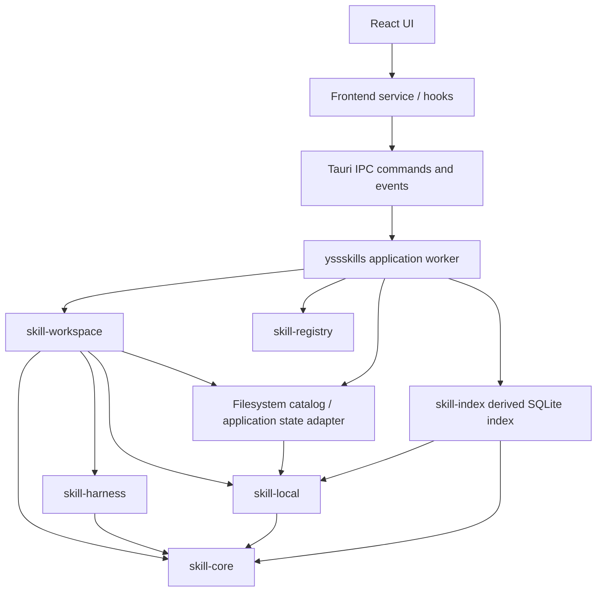

# YssSkills 架构

> 本文是仓库当前实现地图与目标架构的维护型文档。
> `.rules` 定义仓库级工程规则；本文定义模块职责、依赖方向、数据流和
> 重要不变量。两者不一致时，先验证实际行为，再同步更新本文。

## 1. 文档范围与当前状态

YssSkills 是一个通过 Tauri 提供桌面界面的 Skill 管理器。它需要同时处理：

- Skill 的稳定领域模型与 `SKILL.md` 解析；
- 不同 Agent Harness 的位置、能力和配置约定；
- 本机文件系统上的 Skill 扫描、安装和变化；
- 远程 Skill registry 的查询和来源解析；
- Skill 在 Agents、Project 和 Linked 工作区中的部署与同步。

当前仓库已经形成从 React 页面到本地文件系统、SQLite 和远程 registry 查询的真实
纵切片：

- `src-tauri/Cargo.toml` 声明 Cargo workspace，包含根 `yssskills` Tauri package、
  `crates/skill-core`、`crates/skill-harness`、`crates/skill-index`、`crates/skill-local`、
  `crates/skill-registry` 和 `crates/skill-workspace`；
- `skill-core` 提供纯领域类型、`SKILL.md` frontmatter 解析、marker 规则、名称安全
  规范化和 focused tests；
- `skill-harness` 提供内置 Harness、检测与路径解析、能力声明以及自定义 adapter；
- `skill-local` 提供只读扫描/读取/hash、复制、平台 Link、删除以及按显式目标工作的
  有限 watcher；平台 Link 在 Windows 创建 junction，在 macOS/Linux 创建符号链接；
- `skill-index` 提供独立、可丢弃的 SQLite Skill 派生索引、增量 reconcile、原子 rebuild
  和 schema 损坏/不兼容时的安全重建；
- `skill-registry` 提供 skills.sh search/leaderboard 的 blocking client、Next/RSC/JSON
  结构化解析、显式 source kind 保留、GitHub/普通 Git source reference 解析及 typed
  errors；
- `skill-workspace` 提供 Agents/Project/Linked Workspace 模型、目标解析、只读
  `observe`、中央库收敛式 `reconcile` 以及相应公开端口；
- 根 `yssskills` package 提供 SQLite 中央 catalog/Workspace adapter、专用 application
  worker、显式 IPC DTO、结构化错误映射和 Tauri commands；
- 前端 Dashboard、Skills、Workspaces、Registry、Settings 页面通过 application hooks 和
  typed services 调用真实 commands，所有业务 `invoke` 集中在 IPC client；
- registry install、Workspace watcher 自动调度、周期性 reconcile、自定义
  Harness 持久化以及 Workspace 编辑/删除仍未实现，界面不得伪造这些能力。

本文后续章节以代码中的当前实现为准。新增能力应进入已有责任边界，不要为了匹配目录图
一次性生成没有真实责任的空抽象。

## 2. 术语区分

本文中有三个容易混淆的词：

| 术语                                    | 含义                                                                                          |
| --------------------------------------- | --------------------------------------------------------------------------------------------- |
| **Cargo workspace**                     | Rust 工程级概念。把 Tauri 外壳和多个业务 crate 放在同一个依赖、锁文件和构建工作区中。         |
| **`skill-workspace`**                   | 负责 Skill 部署目标、同步关系和收敛编排的业务 crate。                                         |
| **Agents / Project / Linked Workspace** | 产品领域概念。分别表示用户级 Agent Skills、项目 Skills 和外部关联 Skills 被部署或链接到哪里。 |

Cargo workspace 不拥有产品上的 Workspace 状态；`skill-workspace` 也不等同于
Cargo workspace。

## 3. 总体架构

目标架构采用一个 Tauri 外壳、一个工作区编排 crate、一个纯领域 crate 和四个
职责明确的适配 crate：



依赖方向从外向内、从编排到能力实现：

- Tauri 和 React 只位于接口层；
- `skill-workspace` 负责用例编排和部署状态；
- `skill-core` 不依赖框架或基础设施；
- `skill-harness`、`skill-local`、`skill-registry` 各自隔离一种外部变化；
- `skill-index` 只依赖领域值和只读文件系统能力，不拥有 Skill 事实；
- 任何 crate 都不能通过共享内部模块绕过上述依赖方向；
- 不允许循环依赖。

### 3.1 Cargo crate 命名

目标 crate 名称如下。包名使用连字符，Rust 代码中的库名会自然转换为下划线：

| Cargo package     | Rust library      | 责任                                                                                    |
| ----------------- | ----------------- | --------------------------------------------------------------------------------------- |
| `yssskills`       | `yssskills_lib`   | Tauri 启动、application worker、SQLite adapter、commands 和 IPC DTO；保留现有外壳名称。 |
| `skill-core`      | `skill_core`      | Skill 领域模型、解析结果和纯领域规则。                                                  |
| `skill-harness`   | `skill_harness`   | Harness 描述、检测、路径和能力适配。                                                    |
| `skill-index`     | `skill_index`     | 可丢弃的 SQLite Skill 派生索引、查询、reconcile、rebuild 和 schema 自恢复。             |
| `skill-local`     | `skill_local`     | 本机文件系统上的扫描、安装、监听和变化检测。                                            |
| `skill-registry`  | `skill_registry`  | 远程 registry 的搜索/leaderboard 响应解析、source reference 和来源分类解析。            |
| `skill-workspace` | `skill_workspace` | Agents/Project/Linked Workspace 及部署同步编排。                                        |

`skill-harness` 比单独使用 `harness` 更能表达它管理的是 Agent Skill Harness；
`skill-workspace` 则避免与 Cargo workspace 概念混淆。当前 workspace member 以第
1 节为准；`skill-workspace` 和 `skill-registry` 都已接入当前 workspace。`skill-registry`
保持独立的远程 adapter，不成为 `skill-workspace` 的安装依赖。

目标 Cargo workspace 形态为：

```toml
[workspace]
resolver = "2"
members = [
    ".",
    "crates/skill-core",
    "crates/skill-harness",
    "crates/skill-index",
    "crates/skill-local",
    "crates/skill-registry",
    "crates/skill-workspace",
]
```

根 package `yssskills` 仍然是 Tauri 应用，负责把 IPC 请求交给 application worker，
再由应用层调用 `skill-workspace`、SQLite adapter 或 `skill-registry`。各业务 crate 使用
自己的 `Cargo.toml` 和最小依赖集合，共享根目录下的 `Cargo.lock` 与构建产物。

## 4. 模块职责与接口

### 4.1 `skill-core`：Skill 的领域核心

`skill-core` 回答“Skill 是什么”，是最稳定、最纯的模块。它只处理值、身份、
解析结果、领域校验和可预测的状态转换，不执行外部 I/O。

主要职责：

- 定义 `SkillId` 等稳定标识和值对象；
- 定义 `SkillMetadata`、`SkillSource`、`InstalledSkill` 等领域数据；
- 定义 `SKILL.md` 的基础语法解析和 Skill 有效性规则；
- 表达内容 hash、来源身份、版本和解析诊断等跨模块需要的概念；
- 提供不依赖文件系统的纯校验和规范化函数；
- 提供供其他 crate 使用的 typed error 类型。

它不负责：

- 遍历目录、监听文件或创建目录；
- 复制、删除或创建平台 Link；
- 访问网络、读取 registry 或检测 Harness；
- 调用 Tauri、读取 UI 状态或产生 IPC DTO；
- 持久化数据库。

`skill-core` 可以使用标准库，以及确实服务于值解析/序列化的窄依赖；不得
依赖 `tauri`、`notify`、`reqwest`、SQLite、`walkdir` 或 `junction` 等基础设施。
序列化能力不等于允许把内部领域类型直接暴露给前端。

#### 核心概念

- **`SkillId`**：Skill 的稳定身份。调用方不能用裸字符串随意替代它；构造时
  完成格式和非空校验，避免不同来源的同一 Skill 被无意混淆。
- **`SkillMetadata`**：从文档中得到的规范化元数据，例如名称、描述以及来源
  提供的版本信息。它不包含读取文件所需的行为。
- **`SkillSource`**：描述 Skill 来自本地路径、远程 registry、Git 等哪一种来源
  及其可追踪信息。它只表达来源，不负责下载或访问来源。
- **`InstalledSkill`**：描述一个已经在本机有物理或链接落点的 Skill，包括身份、
  元数据、落点、来源和内容 hash。它不执行安装动作。
- **`ContentHash`**：用于比较内容是否变化的值对象。计算由 `skill-local` 完成，
  hash 的含义和比较规则由核心定义。

#### `SKILL.md` 基础规则

基础解析器只解析一个 Skill 文档，不解析 Skill 引用的其他文件，也不执行
Markdown、脚本或 frontmatter 中的内容。最低规则如下：

1. 一个可安装 Skill 的根目录应包含规范名称 `SKILL.md`；为兼容现有生态，发现
   路径也接受精确匹配的 legacy 名称 `skill.md`。`README.md`、`readme.md` 和
   `CLAUDE.md` 永远不是 Skill marker。目录扫描、路径读取和平台差异由
   `skill-local` 处理，核心只提供纯 marker 分类规则。
2. 文件按严格 UTF-8 读取。无法解码时返回结构化解析错误，禁止用替换字符
   静默修复内容。
3. 文件必须以 YAML frontmatter 开始，并存在成对的 `---` 分隔行；未闭合或
   无法解析的 frontmatter 都是解析错误。
4. 有效的可安装文档必须提供非空的 `name` 和 `description` 元数据；未知的
   元数据字段不得改变核心字段的语义，可作为受控的扩展数据保留或忽略。
5. frontmatter 之后的内容是 Skill instruction body，按原文保存；解析器不
   擅自改写 Markdown、展开变量或读取相邻文件。
6. 语法解析和领域有效性校验分开表达。解析失败、字段缺失、字段格式错误和
   业务不变量违反必须能被调用方区分。

这些规则是基础契约。将来如果兼容其他 Skill 格式，应通过显式版本或解析
策略扩展，不应让同一个解析器根据文件内容猜测多个互相冲突的语义。

### 4.2 `skill-harness`：Harness 位置与能力

`skill-harness` 回答“某个 Agent Harness 去哪里找，以及它支持什么”。
它面向 Codex、Claude、Cursor、Gemini、OpenCode 等 Harness，也支持自定义
adapter。

主要职责：

- 定义稳定的 `HarnessId`、Harness 描述和能力集合；
- 检测本机已安装或可识别的 Harness；
- 解析全局 Skill 路径、项目 Skill 路径和配置路径；
- 表达 Harness 是否支持全局/项目作用域、递归发现和配置路径；
- 通过 `CustomHarnessDefinition` 构造并注册自定义 Harness adapter；
- 将平台、环境变量、配置约定转换成结构化位置和能力结果。

它不负责：

- 递归扫描 Skill 目录；
- 读取或解析 `SKILL.md`；
- 计算 Skill hash；
- 安装、删除、复制或链接 Skill；
- 决定某个 Skill 当前是否与目标同步。

Harness 的“检测”遍历 registry 中 adapter 声明的用户级候选路径，并执行受控的
存在性与目录类型判断；只有 Harness 可识别且 global `skills` 目录实际存在的结果
才进入 Auto Detect 候选和 Dashboard 检测计数，用户明确 Add 后才进入 Workspaces Agent
投影。不能把检测实现成对 HOME 的
无界递归 Skill 扫描，以免把项目、依赖缓存或普通同名目录误识别为 Agent。路径结果
使用 `PathBuf` 或等价的结构化路径，不能通过手工拼接字符串生成跨平台路径。
内置 adapter 只提供自动检测候选，不拥有用户可编辑的 Agent 名称和路径；用户选择添加后，
检测结果才转换为根应用层的独立 Agent 配置，Agents Workspace 后续使用配置生成的 adapter
registry。用户目录下的 `.agents/skills` 由 ID 和显示名均为 `agents` 的独立内置 adapter
表示，检测根为 `.agents`；它与其他 Agent 一样经 Auto Detect 和 Add 进入 Workspace，
不作为 Codex、GitHub Copilot、Pi 或 DeepSeek Harness 的额外 discovery 目录。

`CustomHarnessDefinition` 的输入中只有 `id`、`display_name` 和
`global_skills_path` 必填；`project_skills_path`、`config_path` 和 `category`
可选（`category` 缺省为 `Coding`）。`HarnessAdapter::from_custom` 负责校验并
构造 adapter，成功后再由 `HarnessRegistry::register` 注册。自定义定义不包含独立
的 detection rule 或用户声明的 capabilities；能力由 adapter 根据已构造的路径和
适配设置派生。未提供（或为空）的 `config_path` 不产生检测路径，此时 `detect`
返回 `ExplicitlyConfigured`。adapter 不应把内部配置格式泄漏给 `skill-workspace`。

### 4.3 `skill-local`：本机 Skill 管理

`skill-local` 回答“本机磁盘上的 Skill 怎么管理”。它是文件系统和 watcher
的适配模块，负责把文件系统结果转换成 `skill-core` 解析结果、本地操作结果和
有限的变化通知；它不拥有 Harness、registry 或 workspace 的业务状态。

当前已实现的能力：

- **扫描与读取**：`find_skill_marker` 只检查 Skill 目录的直接常规文件，优先识别
  `SKILL.md`，没有它时兼容 `skill.md`；`scan_directory` 支持 `Flat` 和
  `Recursive` 两种模式，递归扫描会把已识别的 Skill 目录作为叶子，并跳过
  `.git`、`.hub` 和 `node_modules`。`Recursive` 当前会解析目录 symlink，并以
  解析后的 canonical path 维护 `visited` 集合来避免循环，因此目录 symlink 可能
  被纳入扫描；这只适用于调用方明确提供的受控扫描根，不代表扫描已经是 no-follow，
  也不能用于递归监控整个 home。`read_skill` 调用 `skill-core` 解析文档，返回
  `ScannedSkill`（包含 marker、文档和内容 hash）；扫描中的单个解析失败进入
  `ScanReport` 的结构化 diagnostics，不会隐藏其他 Skill。
- **Hash**：`hash_directory` 使用排序后的相对路径、文件内容和 Unix executable
  bits 计算 SHA-256；目录内容遍历不跟随内部的链接，并忽略 `.git`、`.DS_Store`、
  `Thumbs.db`、`.gitignore`、`__pycache__` 以及 `.pyc` 文件。
- **低成本变化检测**：`inspect_flat_skill_directory` 和 `inspect_skill_filesystem` 读取
  canonical path、marker mtime/size，并用相对路径、文件 size/mtime 和 Unix executable
  bits 计算 filesystem metadata fingerprint；该 fingerprint 不读取文件内容，只用于判断
  是否需要重新 parse 和 content hash，不能代替最终内容 hash。
- **本地操作**：`copy_skill`、`link_skill` 和 `delete_skill` 分别支持复制、平台
  Link 和删除，并返回明确的 `OperationResult`。`link_skill` 的公开接口不暴露物理
  链接种类；启动时创建的平台 adapter 在 Windows 选择 junction，在 macOS/Linux
  选择符号链接。已有目标策略由
  `ExistingDestination::{Reject, Replace}` 显式传入；安全策略是
  `ExistingDestination::Reject`，但 `copy_skill` 与 `link_skill` 都要求调用方显式
  传入策略，不会在函数内隐式采用默认值；只有显式传入 `Replace` 才覆盖已有目标。
  复制和链接操作完成后都会回读目标 Skill 并重算目录 hash 进行校验。
- **删除安全性**：删除普通 Skill 目录时递归删除；删除符号链接或 junction 时只
  删除链接本身，不跟随或删除其目标。复制操作还会在写入前拒绝嵌套的符号链接或
  junction。这里的 no-follow 语义有明确边界：`hash_directory` 的目录内容遍历、
  `copy_skill` 的嵌套链接预检，以及 `copy_skill`/`link_skill` 移除已有目标、
  `delete_skill` 移除待删路径时的 no-follow 处理，不改变上面
  `scan_directory(Recursive)` 解析目录 symlink 的行为。
- **有限 watcher**：`WatchManager` 对显式 `WatchTarget` 去抖、合并并过滤过期
  generation，输出 `WatchChange` 或 typed error。三种目标的监听语义固定为：
  `Skills` 监听已存在目录的 recursive 变化；`Config` 表示精确文件，物理上监听
  其 parent 的 non-recursive 变化（文件可以尚不存在，但 parent 必须存在）；
  `Discovery` 监听已存在发现根的 non-recursive 变化，只报告根目录下的一级变化。
  watcher 只产生 dirty/invalidation 信号，不代替重新扫描、读取或 hash；它只执行调用
  方提供的显式 target，具体不把 HOME 注册为 recursive `Skills` target 的约束由应用层
  负责，文件系统才是 source of truth。

它不负责：

- `skill-harness` 的 Harness 检测、路径、能力或 adapter 策略；
- `skill-registry` 的远程查询、来源解析或网络访问；
- `skill-workspace` 的 Agents/Project/Linked Workspace 业务策略、部署状态和跨模块
  编排；
- 在没有明确策略和确认的情况下覆盖用户文件。

所有外部路径都是不可信输入。文件操作使用 `Path`/`PathBuf`，处理缺失、
无权限、被移动和并发修改等情况，并把有意义的失败保留为 typed error。
复制和 Link 是不同的业务操作语义，必须在结果中明确表示，不能统一伪装成“安装
成功”；SymbolicLink 与 junction 只是 Link 的平台实现细节，不进入 Workspace、IPC
或持久化接口。

#### 4.3.1 `skill-index`：可丢弃的持久化派生索引

`skill-index` 回答“如何用可重建的 SQLite materialized index 加速中央 Skill 查询”。它只读
`.yss-skills/skills`，复用 `skill-local` 的 metadata inspection、解析和 hash 能力；不复制、
删除或改写 Skill 文件。索引数据库为 Tauri app data 下独立的 `skill-index.sqlite3`，与保存
Workspace/Binding 的 `yssskills.sqlite3` 隔离。

索引记录沿用现有 `SkillId`，并以 normalized path 建立唯一约束。名称、描述、版本、路径、
content hash、marker mtime/size、filesystem fingerprint、indexed time、有效/无效状态和 parse
version 全部是 filesystem SSOT 的派生数据。有效与无效 Skill 分行保存；单个解析失败形成
diagnostic 并从有效列表排除，不使整个索引不可用。

Catalog projection 每次读取用户 HOME 下的 `.agents/.skill-lock.json`，按中央 Skill 的目录名
关联 source metadata。锁文件仍是这部分元数据的唯一事实源，不写入派生 SQLite；匹配项的
`source`、`sourceType`、`sourceUrl`、`skillPath`、folder hash、ref、plugin 与安装/更新时间
通过显式 IPC DTO 返回，未匹配项为 `null`。Skills 列表副标题只显示 lock entry 的 `source`，
不再把中央 catalog 路径伪装成来源；锁文件不存在等价于空 metadata source，其他读取或解析
失败保持 typed error。

reconcile 先读取上次 stamp，只对新增或 stamp 变化的 Skill 执行 `read_skill`、frontmatter parse
和完整目录 hash；未变化记录跳过。扫描与昂贵读取发生在事务外，最终 INSERT/UPDATE/DELETE
和索引 revision 使用单个 SQLite transaction 原子提交。并发写通过 revision compare-and-swap
拒绝过期扫描结果；扫描期间文件再次变化时有限重试，不能把旧扫描覆盖到新 filesystem 状态。

rebuild 在事务外从 filesystem 准备完整结果，再在单事务中替换派生行；失败时旧快照仍可读，
且不会修改真实 Skill。schema 不兼容、integrity check 失败或数据库文件损坏时，独立索引库被
移动为 `.invalid-*` 备份并创建空索引，再仅从 filesystem rebuild。索引库删除后同样走完整
rebuild，不需要任何只能从数据库取得的 Skill 数据。

### 4.4 `skill-registry`：远程来源

`skill-registry` 回答“远程 Skill 从哪里来”。当前实现是一个独立的远程
adapter，接入 skills.sh 的查询和 Git/GitHub source reference 解析；它不依赖
`skill-core`，也不是 `skill-workspace` 的安装依赖。

当前公开能力包括：

- `RegistrySkillId`、`SourceKind`、`RemoteSkillSummary`、`SearchResult`、
  `Leaderboard` 和 `LeaderboardResult` 等远程结果模型；registry identity 与
  `skill_core::SkillId` 明确分离；
- `SkillsShClient` blocking client，使用 `reqwest`，默认请求 `https://skills.sh/`、
  `/trending`、`/hot` 和 `/api/search?q=...&limit=...`。client 默认 15 秒超时，
  校验 HTTP status、认证/限流语义和响应体大小；`Retry-After` 同时解析
  delta-seconds 和标准 HTTP-date 为 typed `RetryAfter::{Delay, At}`，不自动重试；search
  query 去除外围空白后至少包含两个字符；base URL 必须有 HTTP/HTTPS scheme 和 host，
  不接受 query、fragment、userinfo 或 percent-encoded 数据；proxy 同样只接受带 host 的
  HTTP/HTTPS URL，proxy credential 只交给 HTTP adapter，不进入 Debug 输出；body limit
  受全局上限约束且只能降低；
- 纯 `parse_search_response` 和 `parse_leaderboard_html`，分别兼容 skills.sh
  JSON object/legacy array，以及结构化 Next `__NEXT_DATA__` 的
  `props.pageProps.initialSkills|skills|items` 和真正 JavaScript call 中的
  `self.__next_f.push` RSC record stream。RSC payload 按十六进制 `id:JSON` record 读取，
  跳过 `I[...]` 等非 JSON React record，只接受 React tuple 的明确 props object 中的
  `initialSkills|skills|items`（同时兼容既有的 `1:{"props":{"pageProps":...}}` fixture）；
  RSC router props 中的 `error: "$undefined"` 是 React transport sentinel，不作为 registry
  error；普通 JSON/search error envelope 仍不接受这个 sentinel；
  `__NEXT_DATA__` 只接受真实 script 标签的 `id` 属性，RSC marker 只接受 script 内容代码，
  不从 HTML comment、属性值、JavaScript string/comment/regex 或任意 HTML/script 对象和数组猜测
  Skill。
  按 `(source, skill_id)` 去重，并保留显式 `source_kind`、`install_url`、官方标记和
  skills.sh URL；缺失名称回退为 `skill_id`，缺失 installs 回退为零；
- `GitSource`、`parse_git_source` 和显式 known-branches resolver，支持 GitHub
  shorthand、GitHub tree branch/subpath 以及普通 generic HTTPS/SSH Git URL；URL 在解析或
  规范化前拒绝 percent-encoded path 数据和原始反斜杠，普通 `parse_git_source` 拒绝 HTTP、HTTPS
  userinfo、SSH password 和混入凭据的 scp-style 输入，并保留 generic Git host。GitHub
  使用统一的 owner/repo validator，要求恰好两段并拒绝 Git path/control 字符；GitHub
  scp 不接受绝对 path，而 generic scp 保留既有的受控绝对 path 规则。`SourceReference::GitHub`
  只有在最终 clone URL 是真正 GitHub host 且包含合法 owner/repo path 的 HTTPS/SSH/scp
  source 时才成立，`SourceReference::WellKnown` 保留 opaque 输入，其他 source kind 返回
  typed error。解析只产生 source reference，不执行 Git 或文件系统操作；
- `GitCheckout` 为 lock-backed catalog update 提供受控 Git adapter：使用结构化参数执行
  shallow clone，禁用交互提示并设置 90 秒上限；按 lock 的 repository-relative
  `skillPath` 校验边界，再通过 `git archive` 只物化 tracked regular files/directories，拒绝
  symlink、hardlink、special entry 与路径逃逸。多个 Skill 共用同一 source/ref checkout；
- `RegistryError`、`SourceParseError` 等 typed errors，区分 query/limit（包括 legacy
  endpoint 的最小 query 长度）、带 operation 和有限 kind 的运输/超时、HTTP status/认证/
  限流及其 retry-after、响应过大/配置上限、fail-closed 的结构化响应错误和 source 安全/
  类型不匹配错误。search error envelope 只把 absent、null、空字符串和空数组视为空
  sentinel；空对象、bool、number、非空 error/errors 都失败，即使同时带有 skills。运输错误
  不暴露 URL、token、proxy credential 或完整底层错误文本。

当前没有公开或调用官方 `/api/v1` detail endpoint：仓库未确认稳定的 detail
协议，因此没有伪造 detail、版本或未认证成功结果。search 和 leaderboard 已由根应用
通过 `spawn_blocking` 接入 Tauri commands 和前端 service；详情按钮只打开 registry
返回的受信 URL。若将来接入 detail endpoint，bearer 认证和 HTTP 401 必须在此边界
保留为 `AuthenticationRequired`，响应必须解析为明确的结构化 detail，而不能降级为空
结果。

它不负责：

- 把 checkout 直接写入中央库，或调用 `skill-local` 复制/链接/安装；
- 选择 Agents/Project/Linked 目标、创建 `InstalledSkill` 或持有 central catalog；
- 将远程文本错误转换成前端可解析的错误字符串。

远程响应是不可信输入。client/parser 必须验证响应结构、对 `error/errors` 的非法或非空
sentinel fail closed、限制资源规模、使用合理超时，并避免把 proxy 凭据、token、完整请求体
或 Skill 内容写入日志。blocking client 不在 crate 内启动 runtime；根 Tauri command 在
`spawn_blocking` 中执行网络请求。detail endpoint 和 Registry install 仍未实现；Git checkout
仅作为 update staging 输入，应用层复核 catalog/version/source 后才把它交给 `skill-local`，
registry 本身不拥有本地事实。

### 4.5 `skill-workspace`：部署与同步编排

`skill-workspace` 回答“Skill 被部署到哪里，以及当前工作区看到什么”。它是
跨模块的应用编排模块，也是 Agents、Project、Linked Workspace 的领域拥有者。

当前已接入的公开能力包括：

- 定义 `WorkspaceId`、`Workspace`、`WorkspaceKind`、`WorkspaceTarget` 和
  `WorkspaceResolution`；
- `resolve_workspace` 根据 `HarnessRegistry`、`HarnessEnvironment` 和
  `WorkspaceKind` 解析部署目标、发现根及不支持项；
- `WorkspaceEngine::observe` 扫描并读取当前本地状态，解析中央库匹配，返回
  `DeploymentObservation`、未匹配本地 Skill 和结构化诊断；它是只读操作；
- `WorkspaceEngine::reconcile` 导入未匹配的本地 Skill、建立绑定、按 marker 修改
  时间收敛中央库，并把中央库版本传播到对应目标，最后重新执行 `observe`；
- 以 `(SkillId, HarnessId, WorkspaceId)` 为部署键，计算 `NotDeployed`、`InSync`、
  `LocalNewer`、`CenterNewer`、`Missing`、`Unsupported` 和 `Error` 状态。

它不负责：

- 直接递归扫描文件系统或直接调用 `notify`、`reqwest`、junction API；
- 把 Harness 路径规则复制到自己的分支逻辑；
- 把中央库存储实现、Tauri `AppHandle`、窗口或前端 store 带进业务模型。

`WorkspaceEngine<L, C>` 通过窄接口隔离具体能力：

- **`LocalSkillPort`**：提供 `scan`、`read`、`deploy` 和 `delete`，分别对应
  `skill-local` 的扫描/读取、复制或链接部署以及删除，并返回扫描、读取和操作
  结果；它不拥有 Workspace 或中央库状态。
- **`CentralCatalogPort`**：提供中央快照和 Workspace 绑定的读取、按扫描结果解析
  匹配、`import_local`、`update_from_local` 以及 `associate`；中央库的存储方式不
  泄漏到 Workspace 编排器。

`observe` 只调用本地读取和中央库读取/匹配操作，不执行导入、更新、绑定、部署或删除。
`reconcile` 才执行明确的写操作；未匹配本地 Skill 导入中央库后保留原目录，匹配失败、
扫描失败或目标校验失败不会被当作缺失或成功。

`skill-workspace` 的收敛模型是：**中央库是收敛后的唯一事实源**。Agents、Project、
Linked 中与中央库对应的本地 Skill 是部署副本或链接目标。本地变化不会按 watcher
事件顺序直接成为最终状态；在一次 Workspace 的 reconcile 中，比较扫描选出的
`SKILL.md` marker（兼容 `skill.md`）的修改时间。只有内容 hash 不一致且中央与本地
marker 修改时间都可用、同时本地 marker 明确晚于中央 marker 时，才将该本地版本写回
中央库。中央 marker 晚于本地 marker、两者时间相同，或任一 marker 修改时间不可用时，
都由中央库覆盖本地。在同一次 Workspace reconcile 所见的多个本地副本都明确晚于中央
库时，先按 marker 修改时间最新者选择写回候选；时间相同时按规范化路径的字典序确定性
选择。收敛完成后必须重新扫描并计算状态，不定义 `Conflict` 状态。

显式 reconcile 可能导入、更新、恢复缺失目标或传播中央版本时，根应用层先只读观察所有已
注册 Workspace，对每个已绑定 Skill 汇总本地候选并按 marker 时间与无损路径顺序全局选出
一次更新来源；选中的中央更新
完成后，再顺序 reconcile 请求 Workspace 和其他 Workspace。这样后处理 Workspace 不会因
遍历顺序覆盖更晚的本地版本；同一批次首次发现的相同内容也只导入一次并关联全部明确目标。
`WorkspaceEngine` 本身仍只处理传入的单个 Workspace。watcher 触发 reconcile 和周期性
reconcile 尚未由 Tauri 应用调度，当前收敛只由用户显式 Sync 发起。

### 4.6 根应用层、文件系统 Catalog 与 SQLite adapter

根 `yssskills` package 通过专用 `yssskills-application` 单线程 worker 拥有
`Application`、`PersistentCatalog`、Harness registry 和本地文件端口。Tauri async command
使用 message passing 把阻塞的数据库和文件写入工作交给该 worker，不持有同步锁跨 I/O；
独立的 `yssskills-skill-index` worker 在不占用 application command 队列的情况下执行启动
reconcile、metadata scan、parse/hash 和 watcher 驱动的索引更新。registry blocking client 则在
Tauri `spawn_blocking` 中独立执行。两个长期线程均有显式 shutdown、取消标记和 join 生命周期。

`PersistentCatalog` 是 `CentralCatalogPort` 的生产 adapter，组合文件系统 Catalog、SQLite
应用状态和可丢弃的派生索引。`.yss-skills/skills` 是中央 Skill 身份、内容和位置的唯一事实源；
SkillId 继续由现有领域规则从原始目录名确定性派生。列表从索引快速返回，detail 和实际文件
操作仍重新读取 filesystem，发生冲突时 filesystem 结果获胜。应用控制的 import/update/delete
先提交真实文件，再更新派生索引；索引失败不会通过回滚或删除真实 Skill 来迁就缓存。

应用状态数据库只持久化：

- application settings 与中央 catalog root；
- Agents/Project/Linked Workspace 定义；
- `(SkillId, HarnessId, WorkspaceId)` deployment bindings；
- Skill Set 定义及有序的 SkillId membership；
- Dashboard 使用的 catalog import/update 活动。

Skill Set 只是组合中央 Skill 的应用定义，不拥有或复制 Skill 内容。删除 Set 通过外键级联只
删除 membership；不删除 `.yss-skills/skills`、Agent Skill 或 deployment binding。Catalog
Skill 删除会移除对应 membership，外部 filesystem 变化产生的 stale member 在公开 projection
中被过滤。

用户可编辑的 Agent 配置不写入 SQLite，而是保存在 Tauri app data 下独立的
`agents.json`；文件只包含稳定 Agent ID、可选检测器 ID、显示名称和 Agent 根路径，不包含
schema/version 字段。内置 Harness 配置只在没有对应用户覆盖时提供自动发现结果。

应用状态数据库位于 Tauri app data 目录的 `yssskills.sqlite3`，派生索引位于同目录独立的
`skill-index.sqlite3`。首次启动且尚未持久化该设置时，
中央 catalog root 默认为用户主目录下的 `.yss-skills`（Windows 即
`C:\Users\<user>\.yss-skills`）；此后以状态数据库中持久化的设置为准。状态库 schema
不持久化版本字段；数据库为空时初始化当前表结构，既有状态库启动时以 additive、幂等方式
补建 `skill_sets`、`skill_set_members` 及名称唯一索引。索引库
使用独立的 application ID、schema version 和 integrity check，因为它可以安全整体重建。
状态库连接启用 foreign keys、WAL 和 5 秒 busy timeout，索引库同样使用 WAL 和 busy timeout。
路径以无损平台 BLOB 保存：
Unix 保留原始字节，Windows 保留
UTF-16LE code units，不能因数据库序列化强迫路径成为 UTF-8。IPC 另行提供可选无损
字符串与始终可显示的 lossy projection。

中央库布局为 `skills/<原始目录名>`。导入先写入同名的 `cache/<原始目录名>` staging，
校验后 rename 到 `skills`；不同 Skill 的原始目录名冲突时明确失败，不追加 UUID 或覆盖
已有内容。同一进程只补偿删除已经原子取得所有权的路径，无法确认归属的 cache 条目保守
保留。状态库 schema 不包含 `catalog_skills` 表，deployment binding 的 SkillId 外键也不
指向数据库 Skill 行。索引库保存的所有 Skill 字段均可从中央目录恢复，并记录对应 normalized
catalog root，避免切换目录时暴露另一个 root 的旧快照。

已有可用索引时，应用启动只打开数据库并把快照标记为 stale，立即允许列表读取；后台 worker
先注册 targeted recursive watcher，再执行启动 reconcile。新增、metadata fingerprint 变化和
缺失分别形成 INSERT、UPDATE、DELETE，未变化项 SKIP。索引不存在、schema 不兼容或绑定的
catalog root 不同时，启动阶段先从 filesystem 完整 rebuild 首个可用快照。中央目录被手动
新增、修改或删除后，运行期 watcher 触发同一 reconcile；应用关闭期间或 watcher 丢失的事件
由下一次启动 reconcile 恢复。catalog 中已有 Skill 时仍禁止切换 catalog root。

## 5. Workspace 与部署模型

### 5.1 三种业务 Workspace

`Workspace` 由 `WorkspaceId` 和 `WorkspaceKind` 组成；业务 Workspace 只有以下
三种，不引入额外的全局 Workspace 类型：

- **Agents Workspace**（`WorkspaceKind::Agents`）：用户级 Agent Skills 的部署视图，
  本身不携带根路径。`resolve_workspace` 对已检测到且支持 Harness global skills
  scope 的 adapter 生成 `Primary` 目标，并将 adapter 声明的额外 global discovery
  目录作为 `DiscoveryRoot`；其中 `agents` adapter 将 `.agents/skills` 解析为自身的
  `Primary` 目标，而不是 `DiscoveryRoot`。Agents Workspace 固定使用 `Link`，应用
  启动时也会把该 Workspace 的持久化模式和已有 bindings 收敛为 `Link`；Windows 创建 junction，
  macOS/Linux 创建符号链接，实际链接目标必须是当前中央库
  `.yss-skills/skills/<目录名>` 下的对应 Skill。
- **Project Workspace**（`WorkspaceKind::Project { root }`）：绑定项目根目录的部署
  视图。对已检测到且支持 project scope、能解析项目 Skill 目录的 Harness 生成
  `Primary` 目标；不支持的 Harness 进入 `unsupported`，不伪造部署目标。
- **Linked Workspace**（`WorkspaceKind::Linked { root, disabled_root }`）：受控外部
  目录的独立工作区。`root` 解析为 `Primary` 目标，非空的 `disabled_root` 解析为
  `Disabled` 目标；两者都使用递归扫描，并使用由 Workspace ID 派生的稳定逻辑
  Harness ID。根路径先做词法规范化；拒绝 parent directory 段以及规范化路径上的相等
  或嵌套，这不是 canonicalize 后的真实文件系统判断。

`WorkspaceTarget` 记录 Workspace、Harness、目标路径、`Primary`/`Disabled` 角色、
扫描模式和 `Copy`/`Link` 部署模式。`DiscoveryRoot` 仅是只读发现
来源；其扫描结果可参与 `resolve_match`，未匹配项可导入中央库，但它不是
`WorkspaceTarget`，不生成 `DeploymentBinding`，也不自动成为中央库传播目标。
Workspace 是逻辑部署目标，不一定对应单独的磁盘目录；一个 Workspace 可以为不同
Harness 生成不同目标，具体是否可部署由 Harness capabilities 决定。

### 5.2 部署状态

部署状态是由本地扫描、中央库内容、marker 修改时间、Harness 位置和当前部署
结果计算出的结果，而不是前端自行维护的第二份事实。最小状态集合应能表达：

- `NotDeployed`：没有已知目标落点；
- `InSync`：中央库与对应目标内容一致；`Link` 模式还要求实际 Junction/SymbolicLink
  解析后指向该中央 Skill，普通目录或指向 `.agents` 等其他来源的链接不算同步；
- `LocalNewer`：按 §4.5 的收敛规则判定为本地版本较新，reconcile 会将该版本写回
  中央库；
- `CenterNewer`：按 §4.5 的收敛规则判定由中央库覆盖目标，reconcile 会传播中央库
  版本；
- `Missing`：中央快照不存在，或已有绑定对应的本地 Skill 不存在；
- `Unsupported`：Harness 不支持该 Workspace scope，或目标解析不可用；链接/部署
  操作能力失败归为 `Error`，不归为 resolution `Unsupported`；
- `Error`：中央库或本地读取、解析、匹配、部署或其他端口操作失败，且错误上下文仍可
  诊断；中央来源物理路径在 catalog/deployment 操作中不可读或平台 Link 部署失败都
  属于此类，不由 `classify_deployment` 判为 `Missing`。

不定义 `Conflict` 状态；`CentralMatch::Ambiguous` 记录 `Error` 诊断。收敛方向、同一
次 Workspace reconcile 的候选选优以及中央库更新后的应用层遍历规则以 §4.5 为准。
具体枚举名称可以在实现时调整，但不能把这些不同情况压缩成 `bool`、`None` 或空列表。
部署键至少包含 `(SkillId, HarnessId, WorkspaceId)`；同一 Skill 在不同 Harness 或
不同 Workspace 的状态必须独立计算。

## 6. 关键数据流

### 6.1 观察与收敛本地 Skill

`skill-workspace` 的当前流程分为只读的 `observe` 和执行写操作的 `reconcile`：

**`observe`：**

1. `resolve_workspace` 根据 `WorkspaceKind`、已检测 Harness 和 capabilities 返回
   `WorkspaceResolution`，包括目标、发现根和不支持项。
2. `WorkspaceEngine` 通过 `LocalSkillPort` 扫描每个目标和发现根；`skill-local`
   返回 `ScanReport`，其中包含 `ScannedSkill` 和结构化 diagnostics。扫描、读取和
   marker 修改时间由本地端口提供，单次失败不得被抹平成“没有 Skill”。
3. 通过 `CentralCatalogPort` 读取中央快照与当前 Workspace 的绑定，并对扫描结果
   调用 `resolve_match`；唯一匹配进入部署观察，未匹配项进入待导入列表，歧义或
   端口失败进入 `Error` 诊断。
4. `observe` 重新按 `(SkillId, HarnessId, WorkspaceId)` 聚合观察结果和状态；它不
   调用中央库写方法，也不执行本地部署或删除。

**`reconcile`：**

1. 先执行同样的目标解析、中央快照/绑定读取、本地扫描和匹配。有效但未匹配的
   本地 Skill 通过 `import_local` 导入中央库；若它对应目标则通过 `associate`
   建立绑定，原本地目录保留，不在导入动作中删除或替换它。
2. 对每个已有中央快照的关联 Skill，按 §4.5 的 marker 时间与候选规则决定是否通过
   `update_from_local` 更新中央库；候选范围限于本次 Workspace reconcile 所见的本地
   扫描结果。
3. 按当前绑定逐个校验目标；没有扫描/匹配失败且目标内容不同的绑定，通过
   `LocalSkillPort::deploy` 从中央库目标传播。`Primary` 和 `Disabled` 目标都按
   绑定参与传播，失败保留为结构化诊断，不阻断其他目标。
4. 写操作完成后再次执行 `observe`，以重新扫描、读取和计算最终状态。

中央库更新前的跨 Workspace 候选汇总和更新后的顺序 reconcile 已由根 application worker
接入；具体规则见 §4.5。该流程只由显式 `reconcile_workspace` command 触发：Workspaces
的 Sync 和 Skills 页的 Refresh 都是明确入口；`observe_workspace` 及其他页面 Refresh
仍保持只读。

### 6.2 远程 source reference 与本地物化边界

当前远程查询和 lock-backed catalog update 已接入 Tauri command 与前端 service：

1. `skill-registry` 的 client/parser 返回 `RemoteSkillSummary`、`SearchResult` 或
   `LeaderboardResult`；它只保留远程身份和响应元数据。
2. Catalog update plan 只接受 `.agents/.skill-lock.json` 中同时具有受支持 `sourceType`、
   `sourceUrl` 和 `skillPath` 的 Skill；Set selection 在后端展开为有序去重的 member SkillId。
3. Tauri command 先在 application worker 中取得只读 plan，随后在 worker 外的
   `spawn_blocking` 中按 `(sourceUrl, ref)` 分组调用 `GitCheckout`。Git subprocess 不持有应用
   状态或数据库锁。
4. `skill-local` 从受控 tracked-file staging 读取、解析和 hash；application worker 应用前重新
   比对 catalog content hash 与 lock source identity。发生并发变化时该 Skill 失败而不覆盖。
5. replacement 缺少当前非生成文件/目录时返回 `wouldRemoveFiles` 并 hold back；batch 中其他
   Skill 可继续。内容相同返回 unchanged；无完整 lock metadata 返回 unavailable。
6. 只有上述检查通过后才调用现有原子 `update_from_local` seam 更新中央库与派生索引。
7. `skill-workspace` 继续负责 Agents/Project/Linked 目标、绑定和部署收敛；远程
   source reference 不直接变成 `InstalledSkill`、目标路径或本地事实。

后续实现 Registry install 时，仍应通过 service/command 和明确的应用用例接入，
而不是让前端或 command 直接执行 Git、解压或安装流程。

### 6.3 本地变化

本节描述 Workspace watcher 自动调度接入后的必需流程；当前 Tauri 应用已经为中央
`skill-index` 接入 targeted watcher→index reconcile，但尚未接入 watcher→Workspace
reconcile 或周期性 Workspace reconcile。显式 Sync 已接入中央库更新前的全 Workspace
候选汇总和更新后的 Workspace 遍历；`WorkspaceEngine` 每次仍只处理传入的单个 Workspace。

1. `skill-local` 的 `WatchManager` 持有 watcher 生命周期并接收 notify 原始事件；
   watcher 将事件去抖、合并，并转换为有限的本地变化类型。
2. 监听范围约束由应用层负责：应用层不得将 HOME 注册为 recursive `Skills` target；
   HOME 只用于 non-recursive 的 Harness discovery；实际的 skills 目录使用 targeted
   `Skills` watch，配置文件使用 targeted `Config` watch，发现根使用 non-recursive
   `Discovery` watch。`skill-local` 只执行调用方提供的显式 `WatchTarget`。
3. watcher 只标记 dirty/invalidation 并携带需要复查的路径，不把事件顺序当作状态；
   应用层收到失效信号后触发受影响 Workspace 的 `reconcile`，相关目录必须重新扫描、
   重新读取 Skill、计算 hash 和 marker 修改时间，文件系统事实以重新扫描结果为准。
   单次失败不得抹平成“没有 Skill”。
4. reconcile 的收敛方向、中央库更新后的全量 Workspace 处理和候选范围以 §4.5 为准；
   中央库更新后应用层逐个处理所有已注册 Workspace，不能只重做触发变化的 Workspace。
5. 应用层以周期性 reconcile 作为 watcher 丢失、合并或延迟通知时的兜底；操作完成后
   重新扫描并计算部署状态，日志只用于诊断，不参与状态机决策。

## 7. Tauri 与前端边界

### 7.1 Tauri 应用 crate

根 package `yssskills` 承担启动、应用编排和接口 adapter 职责：

1. command 接收 JSON request envelope，并显式反序列化、拒绝未知字段和校验 IPC 输入；
2. command 调用 application worker 或 registry blocking adapter；
3. application layer 编排 Dashboard、catalog、Harness、Workspace 和 settings 用例；
4. 将领域/应用结果映射为公开的 camelCase IPC DTO；
5. 将 typed error 在边界统一映射为稳定的 IPC error DTO。

当前 commands 包括 Dashboard overview、catalog Skill list/detail/delete/export、local folder
import scan/import、Workspace overview/detect-agents/add-detected-agents/delete-agents/create/
save-agent/copy-project-agent-skills/delete-project-agents/observe/reconcile、registry
search/leaderboard 和 catalog root settings。命令处理器不包含递归
扫描、数据库 SQL、复制/链接细节或部署状态规则；这些责任分别留在 application、
`PersistentCatalog`、`skill-local` 和 `skill-workspace`。Tauri 类型只能停留在接口层，不能进入
业务 crate。

### 7.2 前端

前端按以下层次组织：

```text
React view
    ↓
application hook / frontend service
    ↓
typed Tauri invoke / event subscription
    ↓
IPC DTO
```

前端 service 负责命令名、序列化、响应类型和公共错误处理；视图不应散落
直接 `invoke`。前端 store 只保存 UI 状态、缓存或用于展示的 projection，
不复制 Rust 侧的 Skill、磁盘或部署权威状态。路由状态由路由管理，临时交互
状态留在内存，跨会话偏好才进入适当的持久化层。

应用根组件启动后静默预取 all-time registry leaderboard；registry service 对相同
leaderboard 合并 in-flight 请求，并只缓存成功结果五分钟。显式 Refresh 绕过缓存，预取失败
不产生 Toast 且不缓存失败。Registry 页面挂载时复用启动请求或有效结果；search 始终按用户
请求访问远端。

当前前端入口由 `src/app/main.tsx` 加载 `src/app/App.tsx`，由
`src/app/routes.tsx` 创建 `createHashRouter`。共享的 `AppLayout` 提供 shadcn
`SidebarProvider`、`SidebarInset`、顶部标题和路由出口；页面位于
`src/app/pages/`。Hash 路由适用于 Tauri 静态资源加载，不要求桌面应用为每个深层路径
提供额外服务器 fallback。

`src/app/services/ipc-client.ts` 是业务 `invoke` 的唯一入口，负责未知 rejection 归一化和
Zod strict response 校验；各领域 service 固定 command 名和 request envelope。application
hooks 负责加载、刷新、stale request 抑制以及 Workspace create/observe/reconcile 等多步
流程。Workspaces 页的 Agent 列表、路径和 `skillCount` 每次 Refresh 都来自独立 Agent 配置及
其真实 skills 目录，不读取 SQLite deployment bindings；SQLite 仅继续保存
Project/Linked Workspace 定义和 reconcile 所需 bindings。公开的 `agentPath` 以及列表和表单
中的 Agent path 指向 `globalSkillsPath` 的父目录；实际扫描仍使用完整的
`globalSkillsPath`。Workspaces 顶部 Add 根据当前 Tab
选择表单：Agent Tab 打开与 Edit agent 相同布局的 Add agent Dialog；Project Tab 只有选中
Project 后才可打开 Add agent to Project Dialog，并将所选中央 Skills 以 Copy 方式写入所选
Project 范围内的 `<agentPath>/skills`，禁止 Link。系统目录选择器从 Project 根目录打开，
前端拒绝接受范围外路径，后端再以 canonical path 强制校验边界。新 Project Workspace 通过
Project list Dialog 内的 Add 创建。Agent 列表的 Edit 操作复用原有 Agent 表单 Dialog 展示 HOME 检测所得
的名称和路径；
下方 Skills 区域使用中央 Skills 列表数据，
通过与 Skills 页面一致的 Item/Set Tabs 展示，Item 中的当前关联状态来自 Agent Skills 目录
中实际指向中央库的 Link。Set Tab 展示持久化 Set；选择一个 Set 会把其全部有效 member 合并到
当前普通 Skill 多选并立即返回 Item Tab，最终 Agent 请求仍只提交普通 SkillId。Add agent / Save changes
会持久化独立 Agent 配置，并把选择的中央 Skills 通过当前平台 Link 写入
`<agentPath>/skills`。名称和路径都可编辑；路径变化时先写入新路径并保存配置，再只清理旧路径
中确实指向当前 `.yss-skills/skills` 的 Link。普通目录和外部 Link 保持不动；目标同名普通
目录会明确冲突而不覆盖。五个页面均显示真实
loading/error/empty 状态。顶部 Auto Detect 使用所有内置 adapter 检测候选，并在 Dialog 的
紧凑 checkbox 列表中由用户选择 Add；检测本身不修改 Agent 配置。Agent Tab 支持多选删除：
删除会移除 Agent 配置并清空对应 `skills` 中的 Skill；`skills` 根若为 Link 只删除根 Link，
普通目录中的 Skill Link 只删除入口，普通 Skill 目录会递归删除，非 Skill 条目保留。
Project Tab 的 Combobox 选择只更新当前 Project 并触发只读 observe，不自动打开 Project list
Dialog；后端同时遍历所有内置 adapter 的 project-relative 路径，仅把所选项目目录中磁盘上
真实存在的 Agent 路径作为 `projectAgents` 返回，下方列表展示这些 Agent 及 Skill 数量。
Project Tab 的 Auto Detect 复用该检查并只展示当前 Project 结果；下方 Agent 列表支持多选和
Select all，Delete 清空所选 Project Agent 的 Skills 并清理对应 bindings，保留 Project
Workspace 以及其他项目文件。
Skills 页首次加载只读取 catalog；
列表中的来源副标题来自 `.agents/.skill-lock.json` 的匹配 `source`，没有匹配 metadata 时留空；
Set Tab 支持创建、编辑、多选和删除定义。创建/编辑 Dialog 使用与 Agent Skill picker 一致的
紧凑 checkbox Skill 列表；Set 删除确认明确说明只删除定义，不删除后台 Skills；
Update 只对 lock-backed、具有 Git/GitHub source URL 与 repository Skill path 的选择生效；Item
Tab 支持单项/批量，Set Tab 把选中 Set ID 交给后端批量展开。结果区分 updated、unchanged、
unavailable 和结构化 per-Skill failure，潜在文件删除会 hold back 而不覆盖；
用户点击 Refresh 时，hook 通过 Workspace service 取得 Agents Workspace ID、显式调用
reconcile；reconcile 在扫描前只删除各 Agent skills 根一级目录中目标已不存在的
Junction/SymbolicLink，再重新读取 catalog，因此会把发现的 Agent Skill 导入中央库，并
展示同步 diagnostics。其他普通 Refresh 只读取或 observe，Workspaces 只有明确的 Sync 才调用
reconcile。Skills Delete 由确认对话框显式触发：先删除所有已检测 Agent skills 根中的
对应链接/副本，再清理 bindings，最后删除中央 Skill；链接入口必须先于其真实目录删除，
且不得跟随链接删除目标。Skills Import 先打开系统目录选择器，由 application layer 对
选定目录自身或其子目录递归扫描有效 Skill 并将候选和解析 diagnostics 返回选择弹窗；用户确认后后端重新
扫描该根目录，只接受仍在扫描结果中的已选路径，再复制到中央库，已存在的目录名或内容匹配
项作为 skipped 返回。Skills Export 打开系统目标目录选择器，由后端在目标内创建本地时间命名
的 `yss-export-YYYYMMDDHHmm` 文件夹，并以拒绝覆盖策略将已选中央 Skills 按原目录名复制进去；
目标与中央 catalog 重叠或同一分钟的导出目录已存在时明确失败。Registry install、其他
Workspace 编辑和语言切换当前不可用，不得用本地 timer 或临时状态伪造成功。

## 8. 错误、诊断与日志

每个 crate 在自己的边界定义 typed error，并在更外层保留来源信息：

```text
skill-core       → CoreError
skill-harness    → HarnessError
skill-local      → LocalError
skill-index      → IndexError
skill-registry   → RegistryError
skill-workspace  → WorkspaceError
SQLite adapter   → PersistenceError
application      → ApplicationError
Tauri boundary   → IPC Error DTO
```

错误契约要求：

- library crate 优先使用结构化错误枚举，常见实现为 `thiserror`；
- 错误代码、类别和安全上下文与展示文案分开；
- IPC 边界只做一次公开映射，前端不解析错误字符串判断分支；
- IPC Error DTO 的安全 `context`（例如字段、原因、路径和操作）必须由前端统一错误展示
  完整呈现；Toast、页面状态、Dialog 和逐项 diagnostics 不得只显示泛化 `message` 而丢弃上下文；
- 不把失败转换成 `None`、`false`、空集合或看似成功的结果；
- 文件路径、registry 标识等上下文只在确实有助于诊断时公开，并避免暴露敏感
  配置、认证信息和内部实现细节；
- `tracing` 日志用于诊断，不作为业务状态或成功判断的输入。

建议至少区分：无效 Skill 文档、路径不可访问、目标已存在、能力不支持、
来源不存在、远程响应无效、网络超时、运输 operation/kind、中央匹配不明确和 watcher
已停止。调用方应能根据稳定类别决定重试、提示用户或等待下一次收敛；运输错误只携带
安全的有限分类，不要求调用方解析底层错误 prose。registry 当前不自动重试。

## 9. 并发、资源与安全不变量

- 文件扫描、hash、复制、链接等阻塞或 CPU 密集工作不得直接阻塞 async runtime；
  使用 `spawn_blocking`、专用 worker 或现有等价机制。
- 不在锁持有期间执行文件 I/O、网络请求、模型/解析长任务或等待 watcher。
  先在锁内取得最小状态快照，再释放锁。
- watcher、registry client 和后台 worker 必须有明确的所有者、取消方式和关闭
  行为，窗口关闭或资源替换后不能继续修改旧状态。
- 本地路径、registry URL、压缩包和 Harness 配置均视为不可信输入；使用结构化
  路径和参数，避免 shell 字符串拼接。
- 扫描根与操作根必须限制在受控路径；扫描、hash、复制、链接和删除的链接边界与
  失败语义必须显式处理，不能默认允许链接越界。当前本地路径 API 不构成 hostile
  shared-directory sandbox，不得把不可信根当作强隔离边界。
- `skill-local` 的安装操作不得静默覆盖用户文件。`copy_skill` 和 `link_skill` 要求
  调用方显式传入 `ExistingDestination`；只有显式 `Replace` 才能覆盖已有目标。
  `skill-workspace` 的 reconcile 自动收敛只能作用于已识别且已绑定的部署目标，具体
  中央事实源和 marker 规则见 §4.5；不匹配或无法确认归属的目标不得被覆盖。每次观察和
  写入前还会检查 Workspace 安全根到目标 parent 的现有路径链，拒绝其中的 symlink、
  junction 或 Windows reparse point；最终 Skill 路径本身可以是受管链接。该检查降低链接
  逃逸风险，但标准路径 API 仍不是 hostile shared-directory 的强 sandbox。覆盖、删除和
  解除链接必须由编排用例明确授权，并在结果中说明实际动作。
- 认证 token、密码、连接字符串和完整 Skill 内容不得写入日志。

## 10. 测试策略

测试通过各模块的公开 interface 和 seam 验证行为，不启动不必要的 Tauri runtime：

| 模块              | 重点测试                                                                                                                                                                                                                                                                                                                                                                                |
| ----------------- | --------------------------------------------------------------------------------------------------------------------------------------------------------------------------------------------------------------------------------------------------------------------------------------------------------------------------------------------------------------------------------------- |
| `skill-core`      | `SkillId` 和 metadata 不变量、frontmatter/UTF-8 解析、字段缺失和解析错误。                                                                                                                                                                                                                                                                                                              |
| `skill-harness`   | 各 Harness 的位置规则、检测结果、能力声明和自定义 adapter；使用 fake 环境，不依赖真实用户配置。                                                                                                                                                                                                                                                                                         |
| `skill-local`     | 临时目录中的扫描、读取、hash、复制/平台 Link、缺失权限和外部变化；分别验证 Windows junction 与 macOS/Linux 符号链接实现，watcher 测试只覆盖归一化后的行为。                                                                                                                                                                                                                             |
| `skill-index`     | filesystem-only rebuild、metadata skip、增删改 reconcile、无效 Skill 隔离、原子替换、索引删库恢复和不兼容 schema 安全重建。                                                                                                                                                                                                                                                             |
| `skill-registry`  | skills.sh JSON/HTML 搜索与 leaderboard 解析（含明确 Next/RSC 容器、escaped payload、空/无效 envelope 和拒绝任意嵌入对象）、source kind 保留、GitHub/source reference 解析（含 drive/UNC/ref 字符和 HTTPS/SSH credential 安全）、URL/status/body-limit/Retry-After（delta/date）/transport kind/无效响应；使用 stdlib local HTTP seam，不依赖线上 registry。detail endpoint 当前未实现。 |
| `skill-workspace` | 三种 Workspace 的部署状态转换、marker 修改时间选优、中央库收敛、能力不支持和操作后再验证；通过 `LocalSkillPort`/`CentralCatalogPort` seam 验证。                                                                                                                                                                                                                                        |
| `yssskills`       | 文件系统 Catalog 发现/import/update、确定性 SkillId、SQLite schema initialization/reopen、Workspace/binding 持久化、跨 Workspace 全局候选择优、IPC 请求/响应 DTO 和一次性错误映射；限制 Tauri runtime 测试范围。                                                                                                                                                                        |
| 前端              | typed service 的 command/envelope/response/error 契约，以及用户可观察的加载、错误、刷新和显式同步交互；mock IPC/service seam，不复制 Rust 内部实现。                                                                                                                                                                                                                                    |

每个行为只添加能够证明真实项目契约的最小回归测试。纯重构依赖既有覆盖；
发生可观察行为变化时，先补充能够复现该变化的 focused test。

## 11. 目标目录形态

当前已接入的 `skill-local` 最小结构如下，文件名与实际 crate 一致：

```text
src-tauri/crates/skill-local/
├── Cargo.toml
├── src/
│   ├── lib.rs
│   ├── operations.rs
│   └── watcher.rs
└── tests/
    ├── local_contract.rs
    ├── operations_contract.rs
    └── watcher_contract.rs
```

当前整体目录已经包含以下业务 crate；文件名不是接口本身，公共类型仍以各 crate 的
`lib.rs` re-export 为准：

```text
src-tauri/
├── Cargo.toml
├── src/
│   ├── lib.rs
│   ├── main.rs
│   ├── application.rs
│   ├── state.rs
│   ├── persistence.rs
│   ├── persistence/
│   │   └── sqlite.rs
│   ├── commands.rs
│   ├── commands/
│   │   ├── dashboard.rs
│   │   ├── skills.rs
│   │   ├── workspaces.rs
│   │   ├── registry.rs
│   │   └── settings.rs
│   ├── ipc.rs
│   └── ipc/
│       ├── error.rs
│       └── model.rs
└── crates/
    ├── skill-core/
    │   ├── Cargo.toml
    │   └── src/
    ├── skill-harness/
    │   ├── Cargo.toml
    │   └── src/
    ├── skill-index/
    │   ├── Cargo.toml
    │   ├── src/
    │   └── tests/
    ├── skill-local/
    │   ├── Cargo.toml
    │   ├── src/
    │   └── tests/
    ├── skill-registry/
    │   ├── Cargo.toml
    │   ├── src/
    │   └── tests/
    └── skill-workspace/
        ├── Cargo.toml
        ├── src/
        └── tests/
```

当前已接入的 `skill-registry` 最小结构如下：

```text
src-tauri/crates/skill-registry/
├── Cargo.toml
├── src/
│   ├── lib.rs
│   ├── error.rs
│   ├── model.rs
│   ├── skills_sh.rs
│   └── source.rs
└── tests/
    └── registry_contract.rs
```

当前已接入的 `skill-workspace` 最小结构如下：

```text
src-tauri/crates/skill-workspace/
├── Cargo.toml
├── src/
│   ├── lib.rs
│   ├── error.rs
│   ├── model.rs
│   ├── ports.rs
│   └── reconcile.rs
└── tests/
    └── workspace_contract.rs
```

前端对应的接口层按领域 service、application hook 和显式 boundary type 组织：

```text
src/
├── app/
│   ├── hooks/
│   ├── pages/
│   └── services/
│       └── ipc-client.ts
└── shared/types/
```

crate 内部按领域职责组织，而不是按“所有 model 放一起、所有 service 放一起”组织。对外
只暴露实现所需的最小 `pub` surface；文件系统、SQLite、网络和 Tauri adapter 保持在各自
seam 后面。

## 12. 演进规则

新增功能前先判断它属于哪个已有责任：

- 纯身份、值、解析或规则进入 `skill-core`；
- 新 Harness 的位置和能力进入 `skill-harness` 的 adapter；
- 本地磁盘行为进入 `skill-local`；
- 可完全从 filesystem 重建的查询/变化检测索引进入 `skill-index`；
- 新远程来源进入 `skill-registry` 的 adapter；
- 跨多个模块的部署、同步和收敛用例进入 `skill-workspace`；
- IPC DTO、命令和 UI projection 留在接口层。

除非引入了真实且独立的责任，不要新增 crate。若一个接口需要暴露大量内部
类型才能完成工作，先重新检查 seam 和依赖方向；优先加深模块，而不是把
复杂度转移给所有调用方。

`PersistentCatalog` 已作为根 application layer 的 `CentralCatalogPort` adapter 接入：
文件系统负责中央 Skill，状态 SQLite 负责应用状态，索引 SQLite 只负责可丢弃的派生查询数据。
后续若替换或增加其他实现，必须保持同一依赖方向，不能让 SQLite 成为 Skill 内容或身份的
事实源，也不能让 `skill-core` 或业务 crate 依赖具体数据库。
